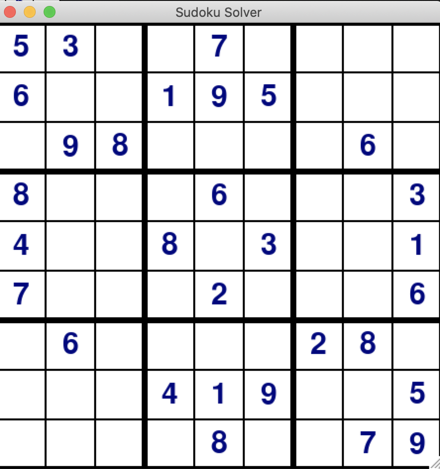

# Sudoku Solver with GUI

This program, written with the help of `pygame` module, allows users to play a 9x9 sudoku game with hints. Here is how a board looks like:

The hints are provided in the command line. In order to play a move, click on the cell and then click on the number that you want to place in that cell.

- If a move is illegal, the number that we have just placed will be marked as red and the corresponding message will be displayed in the command line:
  
  
    

  

  In order to clear a cell, click on button `d` on your keyboard and then click on the cell that you want clear.

- If a move is legal, but the position cannot be solved from the current configuration, the number that we have just placed will again be marked as red and the corresponding message will be displayed in the commaned line:

  
    

  

- If a move is legal and the position can be solved from the current configuration, then the number that we have just placed will be assigned a regular color and the corresponding message will be displayed in the command line:

  
    

  

- If you don't want to play and just want to see the solution to a given position, click on `SPACE` button. Shortly, the following message will be displayed in the command line:

  
    

  * If you press `1`, the solution to the puzzle will be displayed:
  
    
  
    and then a new random position will appear on the screen:

    

    Legal starting positions are stored in `matrices.py` file. Right now, the file contains only three positions. For a greater variety, feel free to add more!

  * If you press `0`, the program will quit with the "Thanks, bye!" message.
